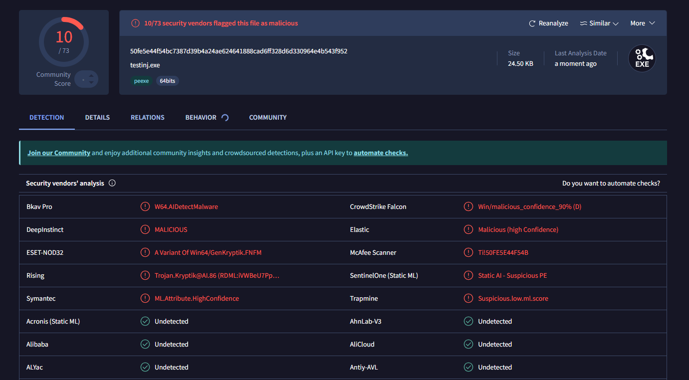
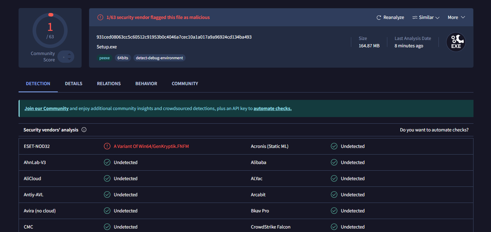

# Remote Dll injector Trojan
Trojan using dll injection of a custom library that spawns a shell on a target machine, undetected by Windows defender and Bitdefener

# 💻 Code

This malware injects a malicious library into a target process or directly creates a process and uploads the library into it, the dll contains a simple encoded base64 data that spawns a reverse shell.

#### DLL

#### Local Injection

#### Remote Injection

# 🛡 Obfuscation and AV Detection 

The local injection is detected by 10 antiviruses, but using a simple certificate and metadata manager like Process Hacker (free an open source) i uploaded the data of a common app (in my case it was github desktop) and the AVs went from 10 to 1 in an instant, and for the first time Bitdefender didn't flag it as suspicious 😀 

